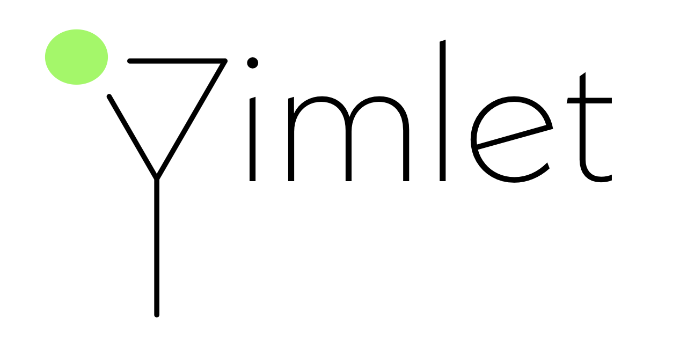

   

# gimlet
Graph Inference on MoLEcular Topology. A package for modelling, learning, and inference on molecular topological space written in Python and TensorFlow.

## Dependencies
`gimlet` doesn't depend on _any_ packages except `TensorFlow 2.0 `, and `pandas` and `pytest`, if you must.

## Examples
https://github.com/choderalab/gimlet/blob/master/lime/scripts/notebooks/190728_yuanqing_gn_with_gru_on_sereina_riniker_dataset.ipynb

## Authors
- yuanqing wang `<yuanqing.wang@choderalab.org><wangyq@wangyq.net>` (while at Chodera Lab at Memorial Sloan Kettering Cancer Center, Weill Cornell Medicine, and the City College of the City University of New York.)

## Manifest
* `gin/` the core (and fun) part of the package.
    * `i_o/` reading and writing popular molecule embedding/representing structures.
    * `deterministic/` property predictions, conformer and charge generations. 
    * `probabilistic/` molecular machine learning through graph networks.
* `lime/` auxiliary scripts.
    * `for_biologists/` ready-to-use modules and scripts.
    * `architectures/` off-the-shelf model architectures developed elsewhere.
    * `scripts/` fun scripts we used to generate data and hypothesis.
    * `trained_models/` _Nomen est omen_.
